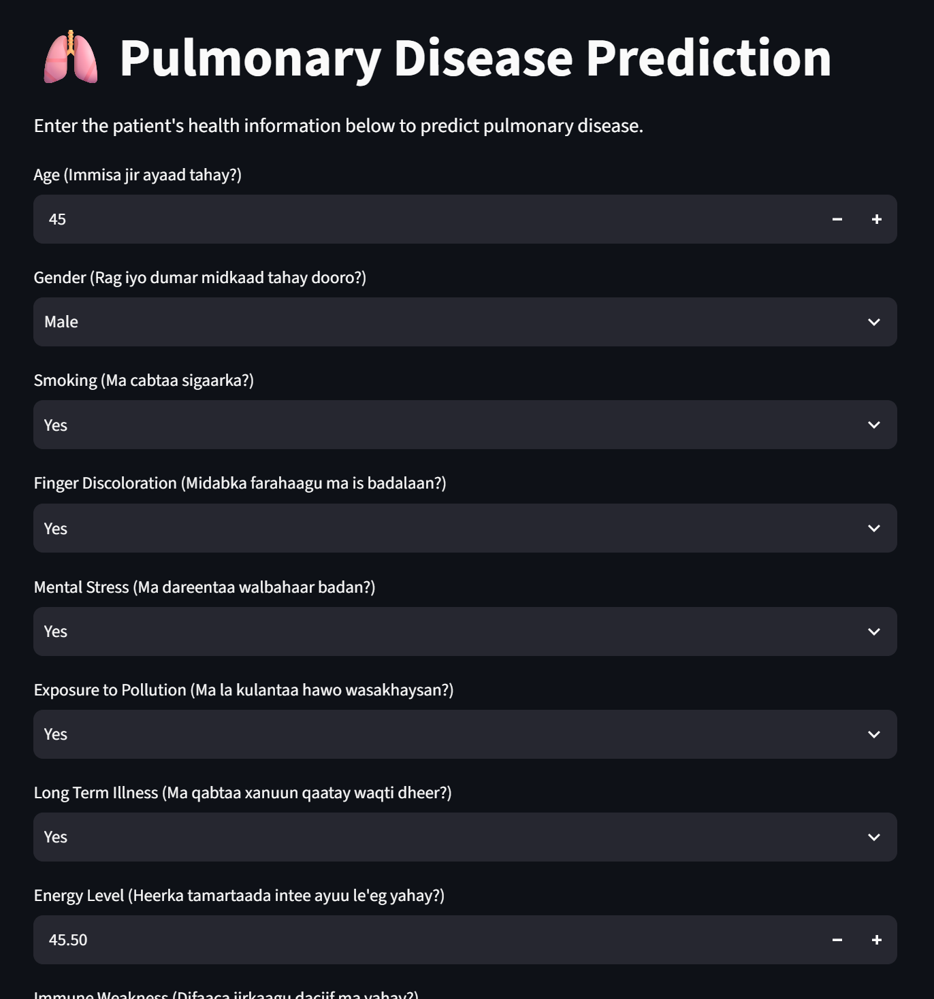

# 🫁 Pulmonary Disease Prediction System

## 📌 Project Overview

The **Pulmonary Disease Prediction System** is a Machine Learning web application that predicts whether a patient is at risk of pulmonary disease based on medical history, lifestyle, and health-related information.

The application is built using **Python**, **Scikit-learn**, and **Streamlit** to provide a simple and interactive interface for users.

## 🌐 Live Demo

👉 **[Open the Pulmonary Disease Prediction App](https://lung-cancer-risk-level-prediction-lgupfmk5mjpvdswn4oeso3.streamlit.app/)**

# 🎯 Objectives

- Predict pulmonary disease risk using Machine Learning.
- Help users understand their potential health risk.
- Provide an easy-to-use web interface.
- Demonstrate the application of Machine Learning in healthcare.


# 🚀 Features

- Interactive Streamlit web application
- User-friendly medical questionnaire
- Pulmonary disease prediction
- Prediction confidence score
- Class probabilities
- Random Forest Machine Learning model
- Data preprocessing using StandardScaler
- Bilingual questions (English with Somali explanations)

## 📁 Project Structure

```
lung-cancer-risk-level-prediction/
│
├── dataset/
│   └── Lung Cancer Dataset.csv
│
├── images/
│   ├── Figure_1.png
│   ├── Figure_2.png
│   ├── Figure_3.png
│   └── Figure_4.png
│
├── models/
│   ├── best_model.pkl
│   └── scaler.pkl
│
├── response/
│   └── response.json
│
├── api.py
├── app.py
├── lung-cancer.py
├── project_paper.md
├── README.md
└── requirement.txt
```

# 📊 Dataset Information

Dataset Name:

**Lung Cancer Dataset**

Number of Rows:

- 5,000

Number of Features:

- 17 Input Features
- 1 Target Variable

Target Variable:

- PULMONARY_DISEASE

# 🩺 Input Features

| Feature | Description |
|----------|-------------|
| AGE | Patient age |
| GENDER | Male or Female |
| SMOKING | Smoking status |
| FINGER_DISCOLORATION | Finger discoloration |
| MENTAL_STRESS | Mental stress |
| EXPOSURE_TO_POLLUTION | Exposure to pollution |
| LONG_TERM_ILLNESS | Long-term illness |
| ENERGY_LEVEL | Energy level |
| IMMUNE_WEAKNESS | Weak immune system |
| BREATHING_ISSUE | Difficulty breathing |
| ALCOHOL_CONSUMPTION | Alcohol consumption |
| THROAT_DISCOMFORT | Throat discomfort |
| OXYGEN_SATURATION | Blood oxygen saturation |
| CHEST_TIGHTNESS | Chest tightness |
| FAMILY_HISTORY | Family history |
| SMOKING_FAMILY_HISTORY | Family smoking history |
| STRESS_IMMUNE | Stress affecting immunity |


# 🎯 Target Variable

| Value | Meaning |
|--------|---------|
| 0 | No Pulmonary Disease |
| 1 | Pulmonary Disease |

# 🛠️ Technologies Used

- Python
- Pandas
- NumPy
- Scikit-learn
- XGBoost
- Joblib
- Streamlit
- Matplotlib
- Seaborn

# 🤖 Machine Learning Models

The following models were trained and evaluated:

- Logistic Regression
- Decision Tree
- Random Forest
- XGBoost

# 📈 Model Performance

| Model | Accuracy |
|--------|----------|
| Logistic Regression | 88.7% |
| Decision Tree | 80.5% |
| Random Forest | **90.4%** |
| XGBoost | 88.5% |

The **Random Forest** model achieved the highest accuracy and was selected as the final prediction model.

# ⭐ Feature Importance

The Random Forest model identified the following features as the most influential in predicting pulmonary disease:

| Rank | Feature | Importance Score |
|------|--------------------------|----------------:|
| 1 | Smoking | 0.212 |
| 2 | Energy Level | 0.155 |
| 3 | Throat Discomfort | 0.111 |
| 4 | Breathing Issue | 0.107 |
| 5 | Oxygen Saturation | 0.096 |
| 6 | Age | 0.081 |
| 7 | Smoking Family History | 0.048 |
| 8 | Stress Immune | 0.033 |
| 9 | Exposure to Pollution | 0.032 |
| 10 | Family History | 0.019 |
| 11 | Immune Weakness | 0.016 |
| 12 | Chest Tightness | 0.016 |
| 13 | Alcohol Consumption | 0.015 |
| 14 | Long Term Illness | 0.015 |
| 15 | Mental Stress | 0.015 |
| 16 | Gender | 0.015 |
| 17 | Finger Discoloration | 0.014 |

The results show that **Smoking**, **Energy Level**, **Throat Discomfort**, **Breathing Issue**, **Oxygen Saturation**, and **Age** are the most important factors influencing the Random Forest model's predictions.

# ⚙️ Data Preprocessing

The following preprocessing steps were applied:

- Data cleaning
- Label encoding (Yes/No → 1/0)
- Target conversion
- Feature selection
- Train-test split
- Feature scaling using StandardScaler (continuous variables only)

Scaled Features:

- AGE
- ENERGY_LEVEL
- OXYGEN_SATURATION

# 💻 Installation

Clone the repository

```bash
git clone https://github.com/muna-adam/lung-cancer-risk-level-prediction.git
```

Go to the project folder

```bash
cd lung-cancer-risk-level-prediction
```

Install dependencies

```bash
pip install -r requirements.txt
```

Run the application

```bash
streamlit run app.py
```

# 🖥️ Application Workflow

1. Open the Streamlit application.
2. Enter the patient's health information.
3. Click **Predict**.
4. The model analyzes the information.
5. The prediction result is displayed.
6. The prediction confidence and class probabilities are shown.

# 📄 Example Prediction

Input:

- Age: 55
- Smoking: Yes
- Breathing Issue: Yes
- Oxygen Saturation: 88
- Chest Tightness: Yes

Output:

```text
Prediction:
Pulmonary Disease

Confidence:
86%
```

# 📦 Sample JSON Response

```json
{
    "prediction": "Pulmonary Disease",
    "prediction_code": 1,
    "confidence": 86.0,
}
```

# 📸 Application Screenshot



# ⚠️ Disclaimer

This application is intended for educational purposes only.

The prediction results should **not** be considered professional medical advice. Always consult a qualified healthcare professional for diagnosis and treatment.

