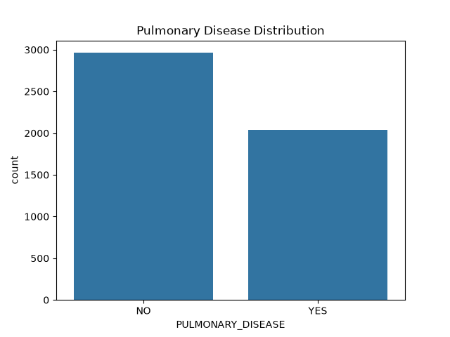
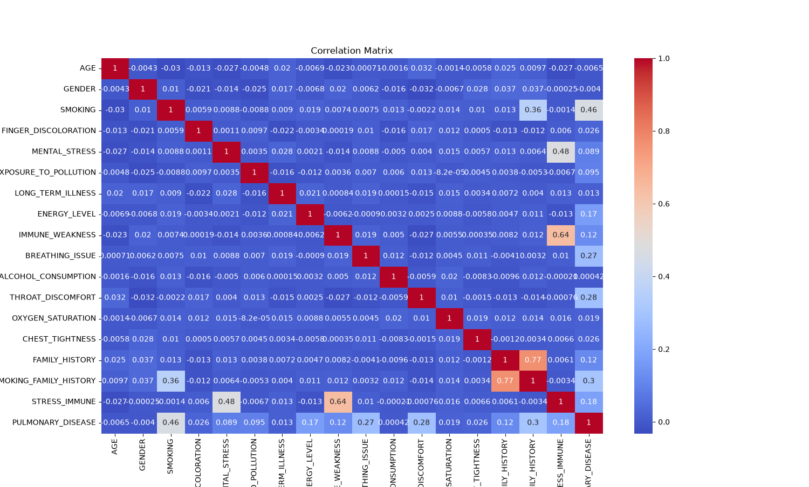
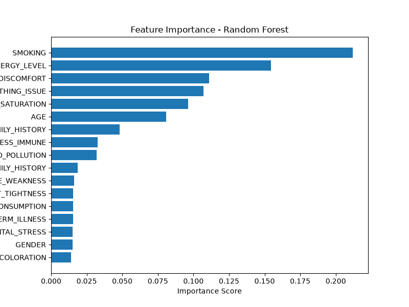

# Pulmonary Disease Prediction System using Machine Learning

## 1. Introduction

Pulmonary diseases are among the leading causes of illness worldwide. Detecting pulmonary disease early can help doctors begin treatment sooner and improve patient outcomes. Machine Learning techniques can analyze patient health information and identify patterns that may indicate disease risk.

The goal of this project is to develop a machine learning model capable of predicting whether a patient is likely to have pulmonary disease based on medical and lifestyle features. Several classification algorithms were trained and compared to determine the best-performing model. Finally, the selected model was deployed as a REST API using Flask.


# 2. Problem Statement

Early diagnosis of pulmonary disease is often difficult because symptoms may resemble other respiratory conditions. Healthcare providers need fast and reliable decision-support systems that assist in identifying high-risk patients.

This project aims to solve this problem by developing a binary classification model that predicts:

- **Yes** → Patient is at risk of pulmonary disease.
- **No** → Patient is not at risk of pulmonary disease.

The prediction is based on patient demographic information, lifestyle factors, symptoms, and medical history.


# 3. Dataset

The dataset used in this project is the **Lung Cancer Dataset**, obtained from Kaggle.

## Source

https://www.kaggle.com/datasets/shantanugarg274/lung-cancer-prediction-dataset

## Dataset Information

- **Number of samples:** 5,000
- **Number of features:** 17
- **Target variable:** `PULMONARY_DISEASE`

### Features Used

- AGE
- GENDER
- SMOKING
- FINGER_DISCOLORATION
- MENTAL_STRESS
- EXPOSURE_TO_POLLUTION
- LONG_TERM_ILLNESS
- ENERGY_LEVEL
- IMMUNE_WEAKNESS
- BREATHING_ISSUE
- ALCOHOL_CONSUMPTION
- THROAT_DISCOMFORT
- OXYGEN_SATURATION
- CHEST_TIGHTNESS
- FAMILY_HISTORY
- SMOKING_FAMILY_HISTORY
- STRESS_IMMUNE

### Target Classes

- Yes
- No

### Dataset Distribution

The target variable consists of 2,963 "No" instances (59.26%) and 2,037 "Yes" instances (40.74%). Although the classes are not perfectly balanced, the level of imbalance is moderate and suitable for training classification models without requiring additional balancing techniques.

### Figure 1. Pulmonary Disease Distribution



# 4. Data Preprocessing

Several preprocessing techniques were applied before training the machine learning models.

## Target Encoding

The dataset already contained the target variable in numerical format (**0** and **1**), therefore no additional encoding was required.

## Missing Values

The dataset contained no missing values, so no imputation was required.

## Outlier Detection

Outlier detection was performed using the IQR method on the continuous numerical features:

- AGE
- ENERGY_LEVEL
- OXYGEN_SATURATION

No outliers were found in **Age**, while a small number of outliers were detected in **Energy Level (31)** and **Oxygen Saturation (30)**. Since these represent less than **1%** of the dataset and tree-based models are generally robust to outliers, no outlier removal was performed.

## Feature Scaling

StandardScaler was applied only to the continuous variables:

- AGE
- ENERGY_LEVEL
- OXYGEN_SATURATION

Binary variables remained unchanged.

## Correlation Analysis

A correlation matrix was generated to understand relationships among the features.

The heatmap indicates that **Smoking**, **Smoking Family History**, **Immune Weakness**, and **Stress Immune** have stronger relationships with the target variable compared to many other features.

### Figure 2. Correlation Matrix



Figure 2 presents the correlation matrix of all features in the pulmonary disease dataset. The heatmap illustrates the strength of the relationship between each feature and the target variable (**PULMONARY_DISEASE**). Correlation values range from **-1** to **1**, where values closer to **1** indicate a strong positive relationship, values closer to **-1** indicate a strong negative relationship, and values near **0** indicate little or no linear relationship.

The results show that **SMOKING** has the strongest positive correlation with pulmonary disease (**0.46**), followed by **SMOKING_FAMILY_HISTORY (0.30)**, **THROAT_DISCOMFORT (0.28)**, and **BREATHING_ISSUE (0.27)**. Most of the remaining features exhibit weak correlations, suggesting that the prediction model benefits from learning the combined influence of multiple features rather than relying on a single variable.

# 5. Machine Learning Algorithms

Four classification algorithms were trained using the same train-test split to ensure a fair comparison.

## Logistic Regression

Logistic Regression is a linear classification algorithm that estimates the probability of class membership using the logistic function. It is simple, interpretable, and computationally efficient.

## Decision Tree

Decision Tree recursively splits the dataset based on feature values to classify patients. It is easy to visualize but may overfit if not properly controlled.

## Random Forest

Random Forest combines many decision trees and aggregates their predictions. It reduces overfitting and generally provides higher accuracy than a single tree.

## XGBoost

XGBoost is a gradient boosting algorithm that builds trees sequentially while minimizing prediction errors. It is widely recognized for high predictive performance.

# 6. Results

Each model was evaluated using:

- Accuracy
- Precision
- Recall
- F1-Score
- Classification Report
- Confusion Matrix

## Model Comparison

| Model | Accuracy | Precision | Recall | F1-Score |
|--------|---------:|----------:|-------:|---------:|
| Logistic Regression | 0.887 | 0.850 | 0.877 | 0.863 |
| Decision Tree | 0.805 | 0.762 | 0.757 | 0.759 |
| Random Forest | **0.904** | **0.889** | **0.872** | **0.880** |
| XGBoost | 0.885 | 0.865 | 0.850 | 0.857 |

Among all models, **Random Forest** achieved the highest overall performance, obtaining the best Accuracy and F1-Score. Therefore, it was selected as the final deployed model.

## Feature Importance

Random Forest also provides feature importance scores that indicate which variables contribute most to the prediction.

The most influential features were:

- Smoking
- Energy Level
- Throat Discomfort
- Breathing Issue
- Oxygen Saturation
- Age

These variables contributed the most to identifying pulmonary disease risk.

### Figure 3. Random Forest Feature Importance



## Sanity Checks

To verify that the trained Random Forest model performs correctly on unseen data, three different sample patient records were tested. Each sample was processed through the deployed model, and both the predicted class and prediction confidence were recorded.

| Patient | Prediction | Confidence |
|----------|------------|-----------:|
| Patient 1 | Yes | 67.00% |
| Patient 2 | Yes | 96.00% |
| Patient 3 | No | 88.00% |

These sanity checks confirmed that the deployed model produces consistent and reasonable predictions for unseen patient data.


# 7. Deployment

The trained Random Forest model was serialized using **Joblib**.

The following artifacts were saved:

- `best_model.pkl`
- `scaler.pkl`

A REST API was developed using **Flask**.

## API Endpoints

### GET /

Returns a message confirming that the API is running.

### POST /predict

Receives patient information in JSON format and returns:

- Prediction
- Prediction Probability
- Risk Percentage

## Example JSON Request

```json
{
  "AGE": 45,
  "GENDER": 1,
  "SMOKING": 1,
  "FINGER_DISCOLORATION": 0,
  "MENTAL_STRESS": 1,
  "EXPOSURE_TO_POLLUTION": 1,
  "LONG_TERM_ILLNESS": 0,
  "ENERGY_LEVEL": 60,
  "IMMUNE_WEAKNESS": 1,
  "BREATHING_ISSUE": 1,
  "ALCOHOL_CONSUMPTION": 0,
  "THROAT_DISCOMFORT": 1,
  "OXYGEN_SATURATION": 93,
  "CHEST_TIGHTNESS": 1,
  "FAMILY_HISTORY": 0,
  "SMOKING_FAMILY_HISTORY": 1,
  "STRESS_IMMUNE": 0
}
```

## Example JSON Response

```json
{
  "prediction": "Yes",
  "confidence": 96.41
}
```

# 8. Lessons Learned

This project provided valuable experience in the complete machine learning workflow.

Key lessons learned include:

- Preparing data correctly is essential for model performance.
- Comparing multiple algorithms helps identify the most suitable model.
- Feature importance helps explain model decisions.
- Saving trained models using Joblib simplifies deployment.
- Flask provides a simple and effective way to expose machine learning models through REST APIs.
- Testing the API with Postman ensures reliable predictions before deployment.

# Conclusion

This project successfully developed a machine learning system for pulmonary disease prediction using patient health information.

Four classification algorithms were compared, and **Random Forest** achieved the highest overall performance with an accuracy of approximately **90.4%**. The trained model was saved using Joblib and deployed as a Flask REST API capable of accepting JSON requests and returning prediction results.

The developed system demonstrates how machine learning can support healthcare professionals by providing fast and accurate decision support for pulmonary disease screening.